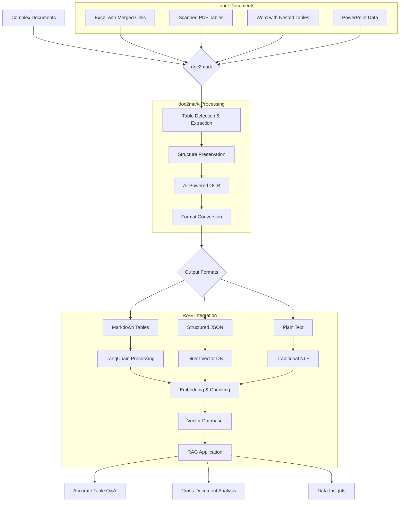

# doc2mark RAG Pipeline Architecture

## Table Extraction Flow for RAG Applications



## Example: Financial Report Processing

### Input: Complex Excel with Merged Cells
```
┌─────────────┬─────────────────────┬─────────────────────┐
│ Department  │      Q1 2024        │      Q2 2024        │
│             ├──────────┬──────────┼──────────┬──────────┤
│             │ Revenue  │   Cost   │ Revenue  │   Cost   │
├─────────────┼──────────┼──────────┼──────────┼──────────┤
│ Sales       │          │          │          │          │
│ - North     │  125.5   │   45.2   │  142.3   │   48.7   │
│ - South     │   89.2   │   32.1   │   95.1   │   35.2   │
└─────────────┴──────────┴──────────┴──────────┴──────────┘
```

### doc2mark Output: Preserved Structure
```markdown
| Department      | Q1 2024        | Q2 2024        |
|                 | Revenue | Cost | Revenue | Cost |
|-----------------|---------|------|---------|------|
| **Sales**       |         |      |         |      |
| - North Region  | 125.5   | 45.2 | 142.3   | 48.7 |
| - South Region  | 89.2    | 32.1 | 95.1    | 35.2 |
```

### RAG Query Examples
1. "What was the North Region's revenue growth from Q1 to Q2?"
2. "Compare costs across all departments for Q1"
3. "Which region had the highest revenue in Q2?"

All queries return accurate results because the table structure is preserved!